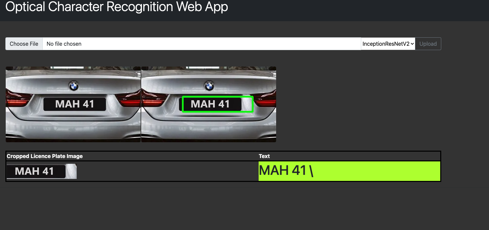

Please see updated project version using YOLO-NAS: [YOLO-NAS-OCR-WebApp](https://jacobj215.github.io/YOLO-NAS-OCR-WebApp/)


# [Optical Character Recognition WebApp](https://github.com/JacobJ215/Optical-Character-Recognition-WebApp)


This is a web application for detecting license plates and extracting text using Optical Character Recognition (OCR) technology. The application is built using Python, OpenCV, Tensorflow, [Ultralytics YOLOv5](https://github.com/ultralytics/yolov5), LabelImg, Pytesseract, InceptionResNetV2, Streamlit and Flask.

# Running the Web App
There are two versions of this web app. The first version was created using streamlit and the second was created using the flask framework.

The flask app runs both InceptionResNetV2 and YOLOv5 whereas the Streamlit App currently only runs the YOLOv5 model.

To run the web apps locally, follow the steps below:

1. Clone the repository
    ```
    git clone https://github.com/jacobj215/Optical-Character-Recognition-WebApp.git
    ```
2. Install the required dependencies
    ```
    pip install -r requirements.txt
    ```
3. To run the streamlit app navigate to the root directory of the project and run 
    ```
    streamlit run app.py
    ```
    This will start the web application, which can be accessed by opening your web browser and navigating to http://localhost:8501.
4. To run the flask app navigate to Flask_App and run
    ```
    python main.py
    ```
    This will start the web application, which can be accessed by opening your web browser and navigating to http://localhost:5000.


5. Upload an image and select the desired model for object detection and text extraction. (Please note: InceptionResNetV2 Model is currently not available on the streamlit app)

# Project Details

## Dataset
The dataset used in this project contains 462 images of cars with license plates. The images were sourced from "Brave Images", "Google Images", and "https://flickr.com/". The annotations were made using LabelImg and Pascal VOC, and the XML files were converted to a CSV in a notebook named imagenet_resnet/data_preparation.ipynb. The data found in this CSV was then converted to YOLOv5 format in a notebook named yolo_v5/
data_preparation.ipynb.

## InceptionResNetV2 Model Training
The InceptionResNetV2 model was trained on a Mac M1 Max 32-Core GPU for 200 epochs. We created a pre-trained Inception-ResNet V2 model without the top layer and froze the pre-trained model's weights. Custom classification layers were defined to be added on top of the pre-trained model. We then created a new model that includes both the pre-trained model and the custom classification layers. The model was compiled with a mean squared error loss function and an Adam optimizer with a learning rate of 1e-4. A ModelCheckpoint callback was used to save the best model based on validation loss. The best model was saved as ./models/object_detection.h5. The model training code can be found in the notebook object_detection.ipynb. 

### Training and Test Loss After 100 Epochs


### Training and Test Loss After 200 Epochs


## YOLOv5 Model Training
The YOLOv5 model was trained using the train.py script with the data.yaml configuration file and pre-trained weights from runs/train/Model2/weights/best.pt. We trained the model for 100 epochs using a Tesla T4 GPU in Google Colab. The best model was saved in the runs/train/exp2 directory. Additionally, we exported the best model to ONNX format using the export.py script with the --weights flag pointing to the saved weights file.

## Validation Batch Results


# Web Application

## Streamlit Web App - YOLOv5


## Flask Web App - InceptionRestNetV2


## Flask Web App - YOLOv5


